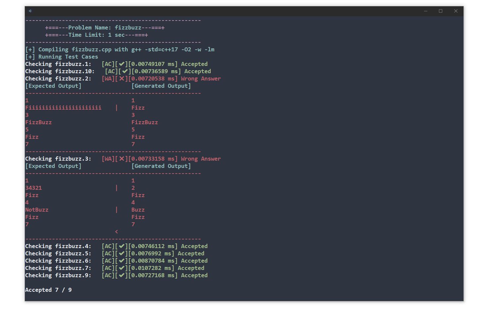

# test-case-tool
Shell-script that automates the process of checking solutions.

Test-case-tool or Tct compiles and runs a program against multiple test-cases and provides feedback for each case.

Tct is still in development and there will be many new changes and additions in the future.

## Demo
In order to use the grader, run the shell script file and pass an ".cpp" file.

```bash
$ ./tcc.sh filename.cpp
```



(example files used in this snapshot can be found in /Demo)

### Usage details
- The program must use stdin input and output
- Input and expected output files must be of the format "filename.#.in" & "filename.#.out"
  - for an file named "test.cpp" the input and output files would be:
    - test.1.in, test.2.in... test.n.in
    - test.1.out, test.2.out... test.n.out
- The number of input files must match the number of expected output files
- The tct.sh file must be placed in the same directory as the source file.
## Supported Languages
Test-case-tool currently only has support for C++.

Support for other C languages, Python and Java will be added in the future.

## What to expect in the future
In the future it is expected that Tcc will have:
- more supported languages(atleast for the C languages, Python and Java)
- better error detection

## Extras

Here are some add-ons I use along with this script

### /add-ons/cp.sh/ 

a simple script to make an directory containing tct.sh (I use this to keep my cp directory from getting cluttered with test-cases)
